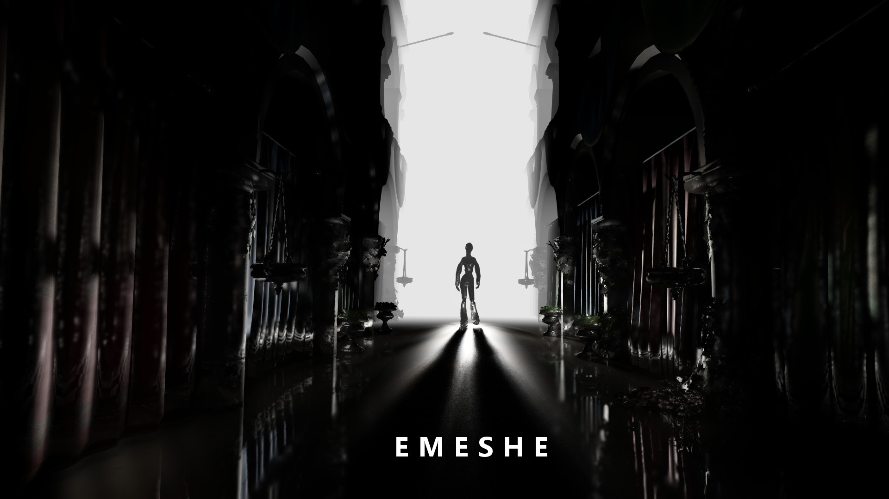

EMESHE
======

Rendering engine for VVVV using DX11 and based on the principles of the great original MRE for DX9. It's a deferred engine most of the effects (lighting, reflection, global illumination, shadows etc.) is done in post process. It is not the fastest one you can find. Actually by performance it's way behind Unity/Unreal Engine/Cryengine trinity standards but as I can recall Emeshe is the closest thing to those engines what you can get in vvvv publicly. Emeshe is also probably the noisiest render engine out there, because of Stochastic methods and artifacts dampened by noise (like irregular sampling in PCSS).

Prezi created for NODE15 can be found here: http://prezi.com/n3gvyzo9szrw

FEATURES
======

* **Lighting / Global Illumination**
  * HDR rendering
  * Only Cook-Torrance model is available yet (Ashikmin-Shirley coming at some point)
  * Multiple Point, Spot, Sun lights
  * Multiple PCSS Shadows for Point-, Spotlights
  * Separated light components for versatile composition
    * Diffuse
    * Specular
    * SSS
  * Stochastic wide range SSAO with temporal reprojection (sampling by UNC) 
    *or Low Frequency SSAO*
  * Alchemy HBAO for short range Local AO (SSLAO) 
    *or High Frequency SSAO*
  * One-bounce stochastic Local Color Bleeding (CSSGI by ArKano22)
  * Environment map based Reflection / Refraction with roughness
  * Screen Space Reflection with roughness
  * Spotlights can have custom texture.
  * Support for ZBrush MatCap
  * Emission

* **Post-Processing**
  * Stochastic "lens blur" DOF with optional "Autofocus"
  * Texture based Bokeh (not implemented properly though)
  * Motion Blur with pixel extension in the direction of motion 
    *(no hard edges)*
  * Tonemapping (HDR to SDR)
    * Filmic (Uncharted 2)
    * Filmic (ALU)
    * Reinhard (standard and modified)
    * Drago Logarithmic
    * Standard linear, logarithmic and exponential
  * Glare with chromatic aberration

* **Forward rendering part**
  * define driven feature switches (opt-out style)
  * Optional Triplanar texture coordinates and sampling
  * Normal mapping
  * Support for automatic and manual instancing 
    *For manual instancing see Geometry part.*
  * Rendertarget for UV coordinates, Material ID and Object ID's

* **Materials**
  * Flags driven modular deferred material system
  * 25 different predefined material features (out of current 32)
  * 70+ possible predefined parameters per material and growing
  * Texture mapped deferred parameters because UV is written in GBuffer
  * Custom features can be added without effort (there's place for 7 custom features)
  * VObject Oriented construction in patch

* **Geometry**
  * Support for previous frame position for animated geometry (used for calculating velocity map for motion blur)
  * Instance or general purpose ID is written next to previous position
  * Simple Decimator
  * Triangle area based tessellation
  * Extruder
  * PN-Triangle tessellation
  * Spherize
  * Splines

USAGE
======

Installation
------

Emeshe requires the following packs to be included in the nodelist of vvvv:

 - mcropack: https://github.com/microdee/VVVV.Packs.mcro
 - VObjects: https://github.com/microdee/VVVV.Packs.VObject
 - (OPTIONAL) if you'd like to read .HDR and .EXR format hdr images (like the panoramas in girlpower) you will need CV.Image Pack for that 
   I'd recommend joreg's fork https://github.com/joreg/VVVV.Packs.Image

Put all of them in the packs folder of VVVV then download (or clone) this repository to the packs folder as well.

**Emeshe is provided "as is", and it's not guaranteed to work in several scenarios. A high-end GPU is required to run this thing at least on a 30 FPS average on 720p (20-25 on 1080p). It will never run on built-in Intel graphics cards or reduced performance mobile GPU's. Read full copyright at the bottom of README.md.**

Forward Part
------

The basic Module which is used for rendering objects on the scene is "DeferredBase (DX11 MRE)" (there's also a PN-Triangle variant not working currently). First determine what semantics your geometry has and turn on features accordingly. Examples: if geometry doesn't have texture coordinates (for instance when saved from blender without unwrapping) turn of "Texture Coordinates". If your geometry is animated and it includes previous position in the COLOR0 semantic you can turn on "Velocity from Geometry". If that animated geometry even have an additional "Instance ID" next to previous position (not SV_InstanceID) you can turn on "Instance from GeomFX" to control parameters per "virtual instance".

These Switches are using #define directives and turning on a feature which is not supported by the geometry (e.g.: turning on "Velocity from Geometry" when a static geometry is connected) will result in a Layout message similar to "Geometry is missing semantics: COLOR" and it won't render.

DeferredBase also provides a layer for mostly shadowmaps called "Prop Layer" which writes world position in RGB channels and distance from camera position in the A channel.

Rendertargets
------

Base layers should be grouped together and connected to the "MRE (DX11)" module which has a MRT renderer set to accept 3 rendertargets.

 - R16G16B16A16_Float for color (RGB) and Material ID (A)
 - R16G16B16A16_Float for normals (RGB) and Object ID (A)
 - R16G16B16A16_Float for velocity (RG) and UV coordinates (BA)

MRE also reads the stencil texture from the Depth. It cons together all of these textures (targets + depth + stencil = 5) which will give us the "GBuffer" texture spread. Also these textures are bundled with the material buffers to form the Resource Semantics group of Deferred part. Emeshe also provides commonly used values as Render/Custom Semantics. These semantics are:

 - MRE_COLOR
 - MRE_NORMALS
 - MRE_VELUV
 - MRE_DEPTH
 - MRE_STENCIL
 - MF_MATERIALMETA
 - MF_FEATUREOFFSET
 - MF_MATERIALDATA

 - CAM_VIEW
 - CAM_VIEWINV
 - CAM_PROJ
 - CAM_PROJINV
 - CAM_POSITION
 - MRE_DEPTHMODE (experimental doesn't really work)
 - MRE_OBJIDMODE (experimental doesn't really work)
 - NEARFARDEPTHPOW (experimental doesn't really work)

Materials
------

Materials are basically describing which part of a shader or which entire set of shaders have to be switched on/off at the current pixel. There are 2 spaces of material (and lights) management, the "Patch space" and the "GPU Space". Adding, removing, setting and combining parameters of materials are done in "Patch space" through "MaterialManager (MRE)" and "FeatureManager (MRE.Materials)" modules. Data coming in from these modules are combined together into 3 StructuredBuffers (data is transformed into "GPU Space") by the "MaterialBuffer (DX11 MRE)" module.

**Patch Space management**

Materials and lights are packed inside VObjects. Materials are collections (VObjectCollection) of features which parameters are represented inside PrimitiveObjects. These PrimitiveObjects (Features from now on) are identified by their flags (bits of a 32bit uint which means the powers of 2) and they are added to a VObjectCollection which represents a Material. These Materials are identified by their ID which will also determine their place in the Material Buffers. Finally Materials are added to the Material Dictionary provided by the MaterialBuffer module.

On FeatureManager modules you can specify the amount of parameters a specific feature can have by their binsize and which feature you want to manage with it Identified by its Feature ID. Note this is different form the flag of a feature which is power of two, the ID is the exponent of which you're raising the 2 on. So FeatureID of 13 will be the flag 0x2000 or 8192. However you can completely ignore this because there are some helper modules which wraps FeatureManager module to set a specific feature, like "AddCookTorrance (MRE.Materials)", "AddFakeSSS (MRE.Materials)", "AddReflection (MRE.Materials)" etc.

MaterialBuffer have a "Global Update" pin which will tell connected material managers and their feature managers to construct themselves and add themselves to the Materil Dictionary so you don"t have to connect a bang to each individual modules contributing to the Material Dictionary. This is also present at all kind of LightBuffers.

**GPU Space Management**

At GPU Space materials are represented by 3 StructuredBuffers. Helper functions and structs for reading materials in shaders are defined in nodes/fxh/Materials.fxh

The first is MaterialMeta (MatMeta : MF_MATERIALMETA) which contains the flags of the features, starting address of the material in the MaterialData buffer and the total size of the material in number of floats.

Second is FeatureOffset (FeatureOffset : MF_FEATUREOFFSET) which contains the starting address of a feature after the material's address in MaterialData buffer. Finally individual parameters are fetched by predefined offsets (inside nodes/fxh/MaterialFeatures.fxh) after MaterialAddress + FeatureAddress from again MaterialData buffer.

And third the MaterialData buffer only stores the individual parameter values necessary for every present features at the scene.

**NOTE:** MaterialBuffer node (and the LightBuffer nodes) are not singletons, Meaning you can have as many separated material and light worlds as you need. However I've yet to find a scenario where multiple material worlds have an actual use.

Lighting
------

There are 3 kind of lights in Emeshe: Point, Spot and Sun. Surprise, surprise: Pointlights are omnidirectional lights from a single point-like source which have a range and a position, Spotlights are actually projected textures defined by a view and a projection transform, and Sunlights are plain simple fixed-directional lights.

**Patch Space management**

In patch space all type of lights are managed the same way, the only difference is the pretty obvious parameters, which also follows a recognizable pattern. Lights similar to materials have a LightBuffer module (PointLightBuffer, SpotLightBuffer, SunLightBuffer), which provide the Light Dictionary. Lights have fixed amount of parameters so adding a light to the dictionary and setting that light can be done with a single "AddLight (MRE.*Light)" module. In Patch space lights are identified by custom unique strings which have no effect on how they will be organized into the LightBuffer. Light Dictionaries also have the "Global Add" behavior similar to what materials have.

**GPU Space management**

Light parameters are provided to the shaders by simple StructuredBuffers. Structures of each light type is defined in nodes/fxh/LightStructs.fxh. In case of Spotlights you also have to provide a Texture2DArray of the projected textures which will be addressed by the TexID element.

For shadows each light type has a separate "ShadowMap (MRE.*Light)" module. Unfortunately for each light you want to cast shadows a separate node have to be created because Renderers are obviously not spreadable. Shadowmaps of a "light world" have to be packed together into a Texture2DArray and you have to set which slice of this array is assigned to which light by the AddLight nodes. Obviously the shadowmaps of the different kind of lights are recommended to be joined together into separate Texture2DArrays.

**Compositing**

Lights then calculated by nodes named after the lighting model (like "CookTorrance (DX11 MRE)"). These nodes will provide 3 textures which represent each components the actual luminance is put together with. These components are (in corresponding order)

0. Diffuse
1. Specular
2. SSS

Light renderer nodes can only operate with a single type of light so if multiple types are used, a separate light renderer node have to be created for each of them. If you want to render shadows you have to turn it on also on the light renderer node which should perform the shadow. Note shadows are switched using a #define directive and turning on or off requires some time to recompile the shader.

Finally the light components are composited together by CompositeLight.tfx which can be controlled by materials as well.

LICENSE
======

Copyright (c) 2015, David Mórász _@mcro.de

Permission to use, copy, modify, and/or distribute this software for any purpose with or without fee is hereby granted, provided that the above copyright notice and this permission notice appear in all copies.

THE SOFTWARE IS PROVIDED "AS IS" AND THE AUTHOR DISCLAIMS ALL WARRANTIES WITH REGARD TO THIS SOFTWARE INCLUDING ALL IMPLIED WARRANTIES OF MERCHANTABILITY AND FITNESS. IN NO EVENT SHALL THE AUTHOR BE LIABLE FOR ANY SPECIAL, DIRECT, INDIRECT, OR CONSEQUENTIAL DAMAGES OR ANY DAMAGES WHATSOEVER RESULTING FROM LOSS OF USE, DATA OR PROFITS, WHETHER IN AN ACTION OF CONTRACT, NEGLIGENCE OR OTHER TORTIOUS ACTION, ARISING OUT OF OR IN CONNECTION WITH THE USE OR PERFORMANCE OF THIS SOFTWARE.
